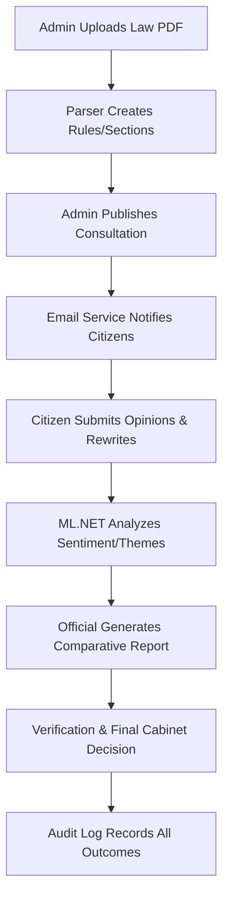

# Digital Public Consultation System (DPCS)

   -green)

An end-to-end platform for Government Transparency, Legislative Consultation, and AI-Powered Public Sentiment Analysis.

---

## 📖 Table of Contents
1. [Project Overview](#-project-overview)
2. [A to Z Functionality](#-a-to-z-functionality)
3. [Key Features](#-key-features)
4. [Technology Stack & Tools](#-technology-stack--tools)
5. [The Workflow](#-the-workflow)
6. [Architecture & Folders](#-architecture--folders)
7. [Getting Started](#-getting-started)
8. [Management & Transparency](#-management--transparency)

---

## 🏛️ Project Overview
The **Digital Public Consultation System (DPCS)** bridges the gap between the government and the public. It allows ministries to publish draft laws and receive structured, section-by-section feedback from citizens. Unlike traditional systems, DPCS uses **Local Machine Learning** to automatically categorize thousands of opinions and **Biometric Verification** to ensure the authenticity of administrative users.

---

## 🚀 A to Z Functionality

### Admin & Officials (Strategic Power)
- **Automatic Document Shredding**: Upload a PDF/DOCX; our parser intelligently converts "Rules" into interactive database objects.
- **Biometric Security**: Integrated [SecuGen Fingerprint Support](wwwroot/js/secugen.js) for high-security official verification.
- **AI Sentiment Engine**: Instantly detect if the public mood is Positive, Negative, or Mixed using local ML.NET.
- **Thematic Tracking**: Identify critical issues like "Privacy," "Sanctions," or "Rights" without reading every comment.
- **Advanced Management**: Comprehensive search and pagination across Users, Locations, and Documents.
- **One-Click Comparative Reports**: Generate official reports for Cabinet review with formatted side-by-side legal text and AI summaries.

### Citizens (The Public Voice)
- **Personalized Dashboards**: Track status of participated consultations.
- **Section-Level Engagement**: Provide feedback on specific parts of a law rather than the whole document.
- **Legal Draft Proposals**: Citizens can suggest exact "better wording" for laws.
- **Instant Email Alerts**: Stay informed the moment a new law is available for review.

---

## 🧠 Key Features
- **Biometric Fingerprint Integration**: Enterprise-grade verification using SecuGen PRO Series scanners via WebAPI.
- **Deterministic AI**: Uses **ML.NET Binary Classification** (SDCA Regression) for high-speed, local sentiment analysis.
- **Blockchain-Lite Audit Log**: Every administrative action is recorded in an immutable chain with hash-based integrity verification.
- **Data Integrity**: Enforced uniqueness constraints for NID, Phone, and Email to prevent identity fraud.
- **Print Optimization**: Dedicated CSS for professional PDF/Print exports for Government records.

---

## 🛠️ Technology Stack & Tools

| Category | Tool / Tech |
| :--- | :--- |
| **Logic** | C# .NET 8.0 (Blazor Server) |
| **UI Components** | [MudBlazor](https://mudblazor.com/) |
| **Intelligence** | [Microsoft ML.NET](https://dotnet.microsoft.com/) |
| **Biometrics** | [SecuGen WebAPI](https://secugen.com/) |
| **Database** | SQL Server + Entity Framework Core |
| **Email** | SMTP / Gmail Service |
| **Layout** | Semantic HTML5 + Custom Vanilla CSS |

---

## 🔄 The Workflow



---

## 📂 Architecture & Folders
- **`PublicConsultation.Core`**: Domain entities (Rule, Opinion, UserAccount) and interface definitions.
- **`PublicConsultation.Infrastructure`**: Implementation details (Db Context, AI Service, Biometric Logic, Doc Parser).
- **`PublicConsultation.BlazorServer`**: The UI layer (MudBlazor Components, Auth logic, JS Interop).

---

## 💻 Getting Started

1. **Set Connection String** in `appsettings.json`:
   ```json
   "DefaultConnection": "Server=...;Database=PubliConDb;..."
   ```
2. **Setup Biometrics**:
   Install **SecuGen WebAPI** (v2.0+) and ensure it's running on `https://localhost:8443`.
3. **Database Migration**:
   ```bash
   dotnet ef database update
   ```
4. **Build & Run**:
   ```bash
   dotnet run --project PublicConsultation.BlazorServer
   ```

---

## � Biometric Authentication Flow

To ensure high-trust administrative actions, DPCS integrates a hardware-accelerated biometric layer:

### 1. Registration Phase
- Officials capture 4 distinct fingerprints (**Left Thumb/Index**, **Right Thumb/Index**) during account setup.
- Images are processed locally; only **ISO-19794-2 Standard Templates** are stored in the database for maximum privacy.

### 2. Verification Phase
- When an official performs a sensitive action (e.g., verifying a citizen's identity), the system triggers a **Live Capture**.
- The captured template is compared against all 4 registered templates using the **SecuGen Matching Engine**.

### 3. Logic & Security
- **Match Score Threshold**: A score of **100+** is required for successful verification (configurable for higher security).
- **Zero-Trust**: Fingerprint matching occurs on the local machine via JS Interop, ensuring the raw biometric data never leaves the secure environment during the comparison.

---

## �🛡️ Management & Transparency

- **`AuditLogList.razor`**: The public-facing transparency portal. Uses hash verification to ensure log entries haven't been tampered with.
- **`LocationSelector.razor`**: Intelligent location picker (Division > District > Police Station) used throughout the system.
- **`UserList.razor`**: A high-performance management console with role-based filtering and instant search.
## AI Package...
- **` pip install sumy nltk vaderSentiment scikit-learn flask numpy'**
- **` pip install flask '**
- **` pip install vaderSentiment '**
- **` pip install scikit-learn '**
- **`  pip install numpy '**
- **`  pip install sumy '**
- **`  pip install nltk '**


---
