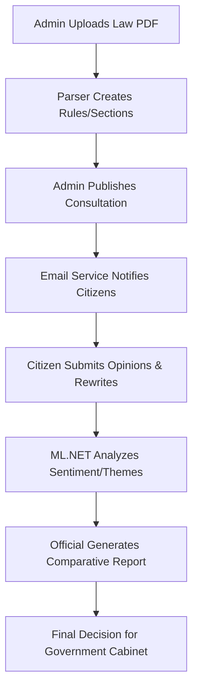

# Digital Public Consultation System (DPCS)

  -green)

An end-to-end platform for Government Transparency, Legislative Consultation, and AI-Powered Public Sentiment Analysis.

---

## 📖 Table of Contents
1. [Project Overview](#-project-overview)
2. [A to Z Functionality](#-a-to-z-functionality)
3. [Key Features](#-key-features)
4. [Technology Stack & Tools](#-technology-stack--tools)
5. [The Workflow](#-the-workflow)
6. [Architecture & Folders](#-architecture--folders)
7. [Getting Started](#-getting-started)
8. [Important Technical Parts](#-important-technical-parts)

---

## 🏛️ Project Overview
The **Digital Public Consultation System (DPCS)** bridges the gap between the government and the public. It allows ministries to publish draft laws and receive structured, section-by-section feedback from citizens. Unlike traditional systems, DPCS uses **Local Machine Learning** to automatically categorize thousands of opinions, saving officials hundreds of hours of manual work.

---

## 🚀 A to Z Functionality

### Admin & Officials (Strategic Power)
- **Automatic Document Shredding**: Upload a PDF/DOCX; our parser intelligently converts "Rules" into interactive database objects.
- **AI Sentiment Engine**: Instantly detect if the public mood is Positive, Negative, or Mixed.
- **Thematic Tracking**: Identify critical issues like "Privacy," "Sanctions," or "Rights" without reading every comment.
- **One-Click Comparative Reports**: Generate official reports for Cabinet review with formatted side-by-side legal text and AI summaries.
- **Feedback Management**: A central command center to browse, search, and manage every opinion.

### Citizens (The Public Voice)
- **Personalized Dashboards**: Track status of participated consultations.
- **Section-Level Engagement**: Provide feedback on specific parts of a law rather than the whole document.
- **Legal Draft Proposals**: Citizens can suggest exact "better wording" for laws.
- **Instant Email Alerts**: Stay informed the moment a new law is available for review.

---

## 🧠 Key Features
- **Deterministic AI**: Uses **ML.NET Binary Classification** (SDCA Regression) for high-speed, local sentiment analysis.
- **Smart Summarization**: Extractive summarization picks the "Main Point" from massive feedback batches.
- **Print Optimization**: Dedicated CSS for professional PDF/Print exports.
- **Responsive Management**: Handles full PDF parsing and rule tracking with E-signature-ready structures.

---

## 🛠️ Technology Stack & Tools

| Category | Tool / Tech |
| :--- | :--- |
| **Logic** | C# .NET 8.0 (Blazor Server) |
| **UI Components** | [MudBlazor](https://mudblazor.com/) |
| **Intelligence** | [Microsoft ML.NET](https://dotnet.microsoft.com/en-us/apps/machinelearning-ai/ml-dotnet) |
| **Database** | SQL Server + Entity Framework Core |
| **Email** | SMTP / Gmail Service |
| **Layout** | Semantic HTML5 + Custom Vanilla CSS |

---

## 🔄 The Workflow



---

## 📂 Architecture & Folders
- **`PublicConsultation.Core`**: Domain entities (Rule, Opinion, User) and interface definitions.
- **`PublicConsultation.Infrastructure`**: Implementation details (Db Context, AI Service, Email Service, Doc Parser).
- **`PublicConsultation.BlazorServer`**: The UI layer (Components, Pages, Auth logic).

---

## 💻 Getting Started

1. **Set Connection String** in `appsettings.json`:
   ```json
   "DefaultConnection": "Server=...;Database=PubliConDb;..."
   ```
2. **Setup Email (SMTP)**:
   Ensure `SmtpSettings` are populated to allow notification emails.
3. **Database Migration**:
   ```bash
   dotnet ef database update
   ```
4. **Build & Run**:
   ```bash
   dotnet run --project PublicConsultation.BlazorServer
   ```

---

## 💎 Important Technical Parts

- **`AiAnalysisService.cs`**: The heart of the AI. It trains a local model at startup to ensure 100% privacy and no cost.
- **`DocumentService.cs`**: Uses custom logic to parse complex legal headers and turn them into navigable sections.
- **`ComparativeStatement.razor`**: The most critical page for officials—the aggregation of all legal and public data.

---
*Empowering Governance through AI and Transparency.*