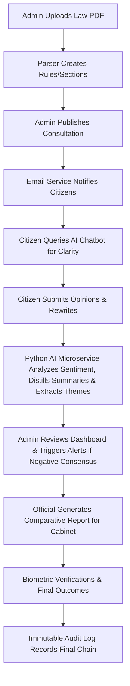

# Digital Public Consultation System (DPCS)

   

An end-to-end platform for Government Transparency, Legislative Consultation, and AI-Powered Public Sentiment Analysis.

---

## 📖 Table of Contents
1. [Project Overview](#-project-overview)
2. [Complete Feature List](#-complete-feature-list)
3. [The AI Ecosystem (Deep Dive)](#-the-ai-ecosystem-deep-dive)
4. [Biometric Security & Management](#-biometric-security--management)
5. [The Workflow](#-the-workflow)
6. [Technology Stack](#-technology-stack)
7. [Architecture & Folders](#-architecture--folders)
8. [Getting Started](#-getting-started)

---

## 🏛️ Project Overview
The **Digital Public Consultation System (DPCS)** bridges the gap between the government and the public. It allows ministries to publish draft laws and receive structured, section-by-section feedback from citizens. Unlike traditional systems, DPCS uses an **advanced AI Microservice** to automatically categorize thousands of opinions, provide an inline legal AI assistant to citizens, and utilizes **Biometric Verification** to ensure the zero-trust authenticity of administrative users.

---

## 🚀 Complete Feature List

### Admin & Officials (Strategic Power)
- **Automatic Document Shredding**: Upload a PDF or DOCX; the backend parser intelligently converts monolithic "Rules" and "Sections" into interactive, granular database objects.
- **Biometric Action Approvals**: Zero-trust architecture using integrated SecuGen Fingerprint hardware for high-security official verifications.
- **AI-Powered Reporting Dashboard**: Real-time analytical dashboard presenting the public consensus score and dominant thematic trends.
- **Batch Opinion Processing**: View AI-summarized insights for hundreds of public comments simultaneously, calculating overarching sentiments.
- **One-Click Comparative Statements**: Generate structured, official PDF/Print-ready comparative reports for Cabinet review, placing original legal text side-by-side with AI-distilled public feedback and specific rewrite suggestions.
- **Advanced Management**: Comprehensive role-based management across Ministries, Locations (Division/District/Police Station level filtering), and Users.

### Citizens (The Public Voice)
- **Personalized Tracking Dashboards**: A dedicated portal to track the status of all participated consultations.
- **Section-Level Engagement**: Unlike traditional feedback forms, citizens can pinpoint and comment on specific sub-sections of a law.
- **Bulk Opinion Forms**: Streamlined interface for experts/organizations to submit multi-section feedback efficiently.
- **Legal Draft Proposals**: Citizens can use a specialized tool to suggest exact "better wording" or legal rewrites.
- **AI Legislative Assistant Chatbot**: An embedded AI chatbot directly inside the consultation view. Citizens can ask complex legal questions, request simplifications of jargon, or query international comparisons, and get instant, context-aware answers.
- **Instant Alerts**: Automated email notifications the moment a new law or draft policy is opened for public review.

---

## 🧠 The AI Ecosystem (Deep Dive)

The AI engine in DPCS has been significantly upgraded into a specialized **Python Flask Microservice** (`PublicConsultation.AiService`) focusing on robust, multilingual natural language processing. 

**Key AI Capabilities:**
1. **Multilingual Sentiment Analysis (DistilBERT)**: Uses HuggingFace Transformers (`lxyuan/distilbert-base-multilingual-cased-sentiments-student`) to natively process English and Bengali, combined with a custom aggressive lexical pattern matcher for romanized Bengali (Banglish) negation and confirmation phrases.
2. **Extractive Context Summarization**: Utilizes **Sumy (LSA Summarizer)** and NLTK to distill lengthy explanatory citizen opinions down to their 1-2 most significant core sentences.
3. **Automated Theme Extraction**: Employs **Scikit-Learn TF-IDF Vectorization** with N-Gram analysis across batch comments to dynamically identify the top 5 dominant conversational themes (e.g., "Privacy", "Tax Rate").
4. **Conversational Legal Assistant**: A continuous context-aware mechanism powering the citizen-facing chatbot to interpret draft laws interactively.
5. **Risk & Sensitivity Alerts**: The AI engine calculates composite "Consensus Scores" across opinions, triggering automatic **Sensitivity Alerts** for officials if the average compound public sentiment drops below critical thresholds.

### Python Dependencies & Libraries
The standalone NLP engine relies on the following specific pip libraries to process citizen feedback securely:
- **`Flask`**: Acts as the lightweight web server API routing, intercepting HTTP POST payloads from the .NET Core interface.
- **`transformers` & `torch`**: Power the HuggingFace `DistilBERT` models. PyTorch handles the underlying tensor computations for fast local sentiment extraction, completely eliminating the need for paid, external endpoints (like OpenAI).
- **`tiktoken`**: An extremely fast BPE tokeniser used to ensure lengthy citizen inputs map correctly to language model constraints.
- **`scikit-learn` & `numpy`**: Drive the mathematical operations for Theme Extraction. Scikit-learn runs the TF-IDF (Term Frequency-Inverse Document Frequency) vectorizer, and NumPy processes the dense matrix array outputs to isolate the top 5 dominant keywords.
- **`sumy` & `lxml`**: Sumy executes the LSA (Latent Semantic Analysis) summarization algorithm to distill long citizen opinions into 1-2 core sentences. `lxml` serves as the high-speed parsing dependency for Sumy's text tree manipulation.
- **`vaderSentiment`**: Provides robust lexicon and rule-based sentiment scoring heuristically. (Used for rule-based overriding on Banglish slang).
- **`pandas` & `joblib`**: Pandas provides structured `DataFrame` manipulation for evaluating massive batches of opinions efficiently in memory. `joblib` caches and optimizes the loading of vectorized models from disk.

---

## 🛡️ Biometric Security & Management

To ensure high-trust administrative actions, DPCS integrates a hardware-accelerated biometric layer:

### 1. Registration & Privacy
- Officials capture 4 distinct fingerprints (Thumbs and Index fingers) during setup.
- Images are processed locally; only **ISO-19794-2 Standard Templates** are transmitted and stored, preserving absolute privacy. No raw images are kept.

### 2. Live Verification
- When an official performs a sensitive action (e.g., finalizing a document, verifying identities), the system triggers a Live Capture modal.
- The captured template is evaluated against the registered templates using the **SecuGen WebAPI Matching Engine**.

### 3. Transparency & Immutable Auditing
- **Blockchain-Lite Audit Log**: Every administrative action, login, and decision is recorded in an immutable audit chain. 
- The public-facing **Transparency Portal** allows hash-based verification to ensure log entries haven't been tampered with post-facto.

---

## 🔄 The Workflow



---

## 🛠️ Technology Stack

| Category | Tool / Tech |
| :--- | :--- |
| **Logic Layer** | C# .NET 8.0 (Blazor Server) |
| **UI Components** | [MudBlazor](https://mudblazor.com/) |
| **AI Microservice** | Python, Flask, HuggingFace Transformers, Sumy, Scikit-Learn |
| **Biometrics** | [SecuGen WebAPI](https://secugen.com/) |
| **Database** | SQL Server + Entity Framework Core |
| **Email/Alerts** | SMTP Client Service |
| **Styling** | Semantic HTML5 + Custom Vanilla CSS |

---

## 📂 Architecture & Folders

- **`PublicConsultation.Core`**: Domain entities (e.g., `Rule`, `Opinion`, `UserAccount`), core business constraints, and interface definitions (`IAiAnalysisService`).
- **`PublicConsultation.Infrastructure`**: Implementation layer containing the DB context, integrations, caching logic, and the HTTP clients bridging the .NET backend to the AI Microservice.
- **`PublicConsultation.BlazorServer`**: The comprehensive presentation layer housing MudBlazor UI views (Citizens, Admins, Transparency portals).
- **`PublicConsultation.AiService`**: The dedicated internal Python microservice powering all NLP workflows.

---

## 💻 Getting Started

1. **Start the AI Microservice**:
   ```bash
   cd PublicConsultation.AiService
   pip install -r requirements.txt
   python app.py
   ```
   *(Running on port 5000 by default, expecting ML models to download on first run).*

2. **Configure .NET Application**:
   Update `appsettings.json` in `PublicConsultation.BlazorServer` with your `DefaultConnection`.

3. **Setup Biometrics**:
   Install **SecuGen WebAPI** (v2.0+) and ensure it is active on `https://localhost:8443`.

4. **Database & Launch**:
   ```bash
   dotnet ef database update
   dotnet run --project PublicConsultation.BlazorServer
   ```
