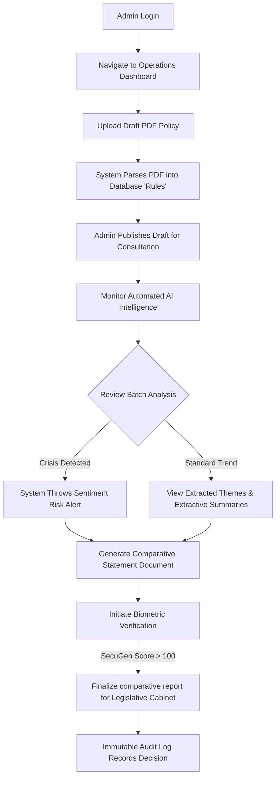

# Digital Public Consultation System (DPCS) - System Architecture & Technical Documentation

This document provides a deep dive into the technical architecture, core algorithms, security mechanisms, and data models powering the Digital Public Consultation System (DPCS).

---

## 1. Core Entities (Domain Data Model)

The system revolves around a robust SQL Server schema mapped via Entity Framework Core. The prominent entities are grouped by their operational domain:

### 1.1 Identity & Security Entities
*   **`UserAccount`**: The central identity representation. Enforces unique constraints upon registration for `Email`, `PhoneNumber`, and `NIDNumber`. Stores hashed credentials (`PasswordHash`) and tracks the user's origin (`PoliceStationId`). Includes states: `IsVerified` and `IsActive`.
*   **`Role`**: Defines the Role-Based Access Control (RBAC) classifications. Linked to users via a Foreign Key (`RoleId`).
*   **`Biometric`**: A secure, isolated entity linking a `UserAccountId` to four distinct fingerprint templates stored strictly as ISO-19794-2 byte strings, shielding raw image data.

### 1.2 Consultation Workflow Entities
*   **`Ministry`**: Represents the government body originating the law.
*   **`DraftDocument`**: The overarching policy or legislative act published for review.
*   **`Rule`**: Crucial micro-components. The backend shredder parses `DraftDocuments` into smaller `Rule` entities. This architecture enables section-by-section public engagement rather than generalized document feedback.
*   **`Opinion`**: Maps a `UserAccount` to a specific `Rule`. Contains the raw `OpinionText`, optional citizen `Suggestion` (rewrite), and internally computed fields for `Sentiment` and `Summary`.

### 1.3 Operations & ML Entities
*   **`AuditLog`**: An append-only historical log for all administrative state changes, enabling the "Blockchain-Lite" transparency features.
*   **`AiAnalysisResult`**: Caches and stores aggregated metrics, holding properties like `ConsensusScore` (0.0 to 1.0), dominant `KeyThemes` arrays, and structural summaries utilized for Comparative Reports.
*   **`Location Matrix`**: Composed of `Division`, `District`, and `PoliceStation` to provide hyper-local demographic tagging.

---

## 2. Roles, Permissions, & Authentication

### 2.1 Role-Based Access Control (RBAC)
Authorizations are structured implicitly by `Role`.
*   **Citizen Role**: Assigned as the system default upon `Register.razor` submission. Grants read access to `DraftDocuments`, write access to `Opinion` endpoints, and interaction with the `LegalChatbot`.
*   **Administrative Roles**: Empowered to access the `Admin/` subsystem. Grants access to `DocumentService` for uploads, Dashboard BI tools to view AI Consensus logic, and system configurations. High-trust actions within this context prompt Biometric Verification.

### 2.2 Standard Authentication & Cryptography
*   **Logic Handler**: `AuthService.cs`.
*   **Hashing**: DPCS implements **BCrypt.Net** to cryptographically hash passwords with adaptive salting.
*   **Uniqueness Checks**: At registration, `IsEmailUniqueAsync`, `IsPhoneUniqueAsync`, and `IsNidUniqueAsync` queries ensure no duplicate entities cause data fragmentation or fraud.

---

## 3. High-Security Validations (OTP & Biometrics)

DPCS enforces multi-layered verification handling depending on the user severity and intent.

### 3.1 Initial Identity Verification (Email OTP)
Used primarily during the Citizen registration workflow to prevent bot-flooding.
1.  **Generation**: Inside `OtpService.cs`, a randomized 6-digit passcode is created.
2.  **Transient Storage**: The OTP is saved in `IMemoryCache` associated with the registrant's email address and tagged with an explicit 5-minute `AbsoluteExpiration`.
3.  **Delivery & Verification**: Pushed via SMTP through `EmailService.cs`. The user's input (`Register.razor`) is validated against memory. A hit clears the cache and marks the initial step as `isEmailVerified = true`.

### 3.2 "Zero-Trust" Biometric Validations
Ensures ultimate repudiation prevention for Administrative accounts.
1.  **Framework integration**: Connects with `SecuGen` hardware via WebAPI bindings.
2.  **Comparison Logic**: `BiometricService` manages the domain interaction, but **Match Operations** operate locally within the client ecosystem via Javascript Interop. By transmitting the ISO template to the browser instead of raw hashes to the server, interception risk is minimized.
3.  **Threshold Requirements**: A stringent "Score > 100" algorithmic logic dictates action success. Used to confirm Administrative logins and before finalizing comparative statements for Cabinet.

---

## 4. Key Functions and AI Logics

The project's architectural standout is its automated workflow combining C# data processing with a custom Python NLP Flask Microservice.

### 4.1 Parser Logic (`DocumentService`)
When a document is uploaded, it must bypass traditional blob-storage. The parser parses headings and paragraphs via RegEx patterns, creating discrete `Rule` (Row) elements in the database automatically. 

### 4.2 Distributed AI Feedback Intelligence
Once opinions are registered on a `Rule`, the logic offloads via HTTP to the Python Microservice `AiAnalysisService`:
*   **Sentiment Extraction Logic**: Handles multilingual comments (`English` + `Bengali`). Before relying natively on DistilBERT (`lxyuan/distilbert-base-multilingual-cased-sentiments-student`), a customized `re.search` overrides the model, looking for hard-coded exact phrases denoting Negation (e.g., `ekmot noi`, `nai`) or Positivity (e.g., `sohomot`) inside Romanized Bengali expressions.
*   **Calculated Consensus**: Sentiments assign a compound `Probability` score (-1.0 to 1.0). The `AnalyzeBatchAsync` functionality averages the batch probability. **Logic Rule**: If `avg_compound < -0.3`, a `Sensitivity Alert` is explicitly thrown to officials.
*   **Theme Extraction Algorithm**: Implemented by feeding all text chunks from an Opinion Batch into Scikit-Learn’s `TfidfVectorizer`. Using 2-nGram matrices, it mathematically selects the top 5 frequently utilized nouns that don’t exist in standard English stopwords, directly defining the "Key Themes" attribute shown to admins.

### 4.3 AI Chatbot Contextual Logic
The `LegalChatbot.razor` UI passes the `DocumentId` context and the citizen's query. The logic isolates the underlying `Rules` attached to that document and injects them alongside the system query to contextualize accurate legal translations instantly without altering the fundamental entity framework.

### 4.4 Comparative Matrix Output
To connect the loop safely to legacy government flow, the `Admin/Reports/ComparativeStatement.razor` binds raw law text alongside aggregate AI Summaries, yielding an easily readable, section-by-section generated grid ready to be exported for high-level officials without any manual data crunching.

---

## 5. Role-Based Workflows

The system diverges operationally based on the authenticated actor's `Role`. Below are the core journey maps for both Citizens and Administrative Officials.

### 5.1 Citizen Workflow (The Public Voice)
The Citizen role is strictly structured around review, comprehension, and contribution to policies.

```mermaid
graph TD
    %% Styling
    classDef startEnd fill:#1A237E,stroke:#fff,stroke-width:2px,color:#fff;
    classDef process fill:#E8EAF6,stroke:#3F51B5,stroke-width:2px,color:#1A237E;
    classDef decision fill:#FFF3E0,stroke:#FF9800,stroke-width:2px,color:#E65100;
    classDef action fill:#E0F2F1,stroke:#009688,stroke-width:2px,color:#004D40;
    classDef automated fill:#FCE4EC,stroke:#E91E63,stroke-width:2px,color:#880E4F,stroke-dasharray: 5,5;

    %% Nodes
    A([Start: Citizen Visits DPCS]) ::: startEnd
    
    %% Onboarding
    B{Has Account?} ::: decision
    C[Navigate to Register Page] ::: process
    D[Input Details: Email, Phone, NID, Location] ::: action
    E[[System Sends OTP via Email]] ::: automated
    F{Verify OTP?} ::: decision
    G[Account Activated & Role Assigned] ::: process
    H[Login to Portal] ::: action
    
    %% Dashboard
    I[View Citizen Dashboard] ::: process
    J[[System Sends Email Alerts for New Laws]] ::: automated
    K[Browse Active Consultations] ::: action
    
    %% Engagement
    L[Open Specific Draft Law] ::: process
    M{What to do next?} ::: decision
    
    %% Actions
    N[Ask Legal Chatbot about Legal Jargon] ::: action
    O[[AI Analyzes Rule & Replies]] ::: automated
    P[Select a specific 'Rule' / Section] ::: action
    Q[Input Opinion + Propose Rewrite] ::: action
    R[Use Bulk Form for Multiple Rules] ::: action
    
    %% Completion
    S[[AI Microservice Computes Sentiment & Theme]] ::: automated
    T[Track Submission in Profile History] ::: process
    U([End: Feedback Received]) ::: startEnd

    %% Relationships
    A --> B
    B -->|No| C
    C --> D
    D --> E
    E --> F
    F -->|Invalid| D
    F -->|Valid| G
    G --> H
    B -->|Yes| H
    
    J --> H
    H --> I
    I --> K
    K --> L
    L --> M
    
    M -->|Confused by terms| N
    N --> O
    O -.-> M
    
    M -->|Provide Feedback| P
    P --> Q
    
    M -->|Expert / Org| R
    
    Q --> S
    R --> S
    
    S --> T
    T --> U
```

**Key Steps:**
1. **Onboarding**: Uses OTP verification to establish an active identity.
2. **Context Searching**: Citizens open a draft and interact with the `LegalChatbot.razor` to understand complex sections.
3. **Engagement**: Instead of generic document comments, the citizen navigates to specific `Rule` blocks and injects their raw feedback & legal rewrites via the `OpinionDialog.razor`.

### 5.2 Admin / Official Workflow (Strategic Management)
The Administrator role is provisioned for creating consultations, analyzing systemic intelligence, and preparing secure documentation for high-level government bodies.



**Key Steps:**
1. **Creation**: Admin uploads standard documents and lets the `DocumentService` shred the file into granular database rows.
2. **Analysis**: Continuously monitors the `PublicOpinions.razor` dashboard where the Python AI Microservice returns batch consensus and extracted vocabulary themes.
3. **Reporting & Security**: Compiles a professional Comparative Statement. Before this statement can be marked "Final" or altered, the `BiometricService` halts the interface and mandates a live fingerprint scan via SecuGen, verifying the officer's physical presence. All transitions are permanently hashed into the `AuditLog`.

### 5.3 Artificial Intelligence (NLP) Workflow
The AI Microservice operates as a standalone Python engine. When opinions are generated by citizens, the .NET backend fires them asynchronously to this engine for analytical crunching.

```mermaid
graph TD
    %% Styling
    classDef dotNet fill:#E3F2FD,stroke:#2196F3,stroke-width:2px,color:#0D47A1;
    classDef apiRoute fill:#F3E5F5,stroke:#9C27B0,stroke-width:2px,color:#4A148C;
    classDef internalLogic fill:#FFFDE7,stroke:#FBC02D,stroke-width:2px,color:#F57F17;

    A([.NET Core Application]) ::: dotNet -->|HTTP Data Payload| B{Python Flask API} ::: apiRoute
    
    subgraph singleSentiment [Single Sentiment Route]
        B -->|POST /analyze_sentiment| C1[Check Custom Regex Rules] ::: internalLogic
        C1 --> C2[Execute DistilBERT Transformer] ::: internalLogic
        C2 --> C3[Calculate Positive/Negative Score] ::: internalLogic
    end
    
    subgraph docSummarization [Document Summarization]
        B -->|POST /summarize| S1[Format large text block] ::: internalLogic
        S1 --> S2[Run Sumy LSA Summarization] ::: internalLogic
        S2 --> S3[Extract top 2 core sentences] ::: internalLogic
    end
    
    subgraph batchIntelligence [Batch Intelligence]
        B -->|POST /analyze_batch| B1[Score Individual Sentiments] ::: internalLogic
        B1 --> B2[TF-IDF N-Gram Vectorization] ::: internalLogic
        B2 --> B3[Extract top 5 prominent Themes] ::: internalLogic
        B3 --> B4{Compute Average Sentiment} ::: internalLogic
        B4 -->|< -0.3| B5[Set Risk Alert = TRUE] ::: apiRoute
        B4 -->|>= -0.3| B6[Set Risk Alert = FALSE] ::: apiRoute
    end
    
    C3 --> Z([Return JSON to .NET]) ::: dotNet
    S3 --> Z
    B5 --> Z
    B6 --> Z
```

**Key Steps:**
1. **Delegation**: The Blazor frontend leaves heavy logic to Python. It ships text payloads to Flask routes.
2. **Analysis Pipelines**: The system routes logic correctly. Individual sentiments run through `DistilBERT` coupled with hard-coded Regex overrides for common Bengali slangs that transformers might incorrectly classify.
3. **Consolidation**: Instead of storing every analysis, batch loops summarize text using Extractive mathematics (Sumy) and vectorize thematic keywords (TF-IDF) before handing it back to C# for Dashboarding.
